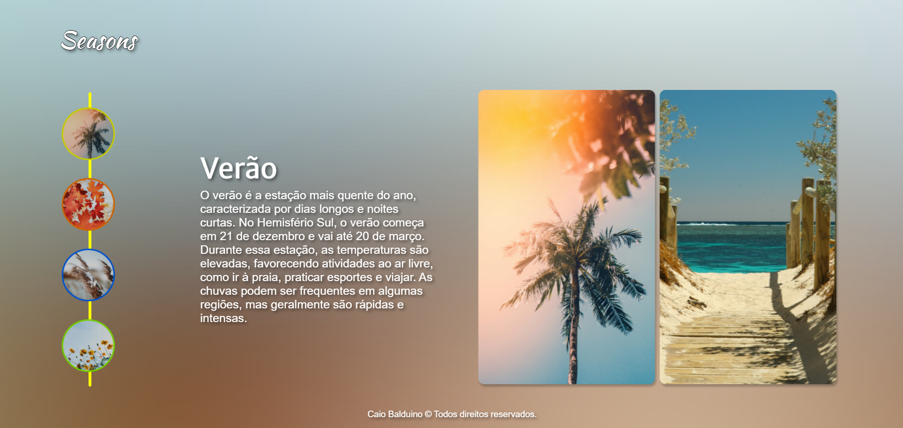

#  Seasons 


"Seasons" é um projeto interativo que explora as quatro estações do ano: Verão, Outono, Inverno e Primavera. Utilizando uma navegação intuitiva com duas listas de itens relacionadas 1:1, o projeto oferece uma experiência visual e informativa que destaca as características únicas de cada estação.

## Funcionalidades

- **Navegação Intuitiva**: Clique nos ícones das estações para visualizar informações detalhadas e imagens associadas a cada estação.
- **Animações Suaves**: As transições e animações melhoram a experiência do usuário, proporcionando uma navegação fluida.
- **Mudança Dinâmica de Fundo**: O fundo da página muda dinamicamente conforme a estação selecionada, criando uma imersão visual correspondente a cada estação.
- **Linha de Destaque Interativa**: Uma linha de destaque muda de cor para corresponder à estação selecionada, melhorando o feedback visual.

## Estrutura do Projeto

### HTML

A estrutura básica da página inclui:

- Uma lista de ícones representando cada estação.
- Uma área de conteúdo que exibe informações detalhadas sobre a estação selecionada.
- Uma seção de imagens correspondente à estação selecionada.
- Uma linha de destaque por trás de cada estação que muda de cor conforme a estação clicada.

### CSS

O estilo da página utiliza:

- Layout de grid para posicionar os elementos principais.
- Transições e animações CSS para uma experiência de navegação suave.
- Propriedades de background para ajustar dinamicamente o fundo da página conforme a estação selecionada.
- Responsividade Mobile.

### JavaScript

A funcionalidade interativa é gerenciada por JavaScript:

- Adiciona e remove classes para mostrar ou ocultar conteúdo e imagens correspondentes à estação selecionada.
- Muda dinamicamente o fundo da página, os textos e a cor da linha de destaque conforme a estação selecionada.

## Como Usar

1. **Clone o repositório**:
   ```bash
   git clone https://github.com/seu-usuario/seasons.git

2. **Navegue até o diretório do projeto**:
   ```bash
   cd seasons

3. **ou Abra o arquivo index.html em um navegador para visualizar o projeto**.</br>
(você também consegue vê-lo pelo link do deploy feito na vercel à direita, abaixo da descrição do projeto -> )

## Autor
<a href="https://github.com/Caiobaldudev">
  
</a>
<h3>Caio Balduino</h3>

## Imagens utilizadas (Atribuições/Permissões)

- Verão: </br>
Foto de <a href="https://unsplash.com/pt-br/@artycial?utm_content=creditCopyText&utm_medium=referral&utm_source=unsplash">arty</a> na <a href="https://unsplash.com/pt-br/fotografias/foto-de-palmeiras-verdes-n_GGaQHqT4Q?utm_content=creditCopyText&utm_medium=referral&utm_source=unsplash">Unsplash</a></br>
Foto de <a href="https://unsplash.com/pt-br/@heycrisso?utm_content=creditCopyText&utm_medium=referral&utm_source=unsplash">Chris Galbraith</a> na <a href="https://unsplash.com/pt-br/fotografias/corpo-de-paisagem-de-agua-7XAM0J3dNQM?utm_content=creditCopyText&utm_medium=referral&utm_source=unsplash">Unsplash</a>
  
- Outono:</br>
Foto de <a href="https://unsplash.com/pt-br/@ohutcherson?utm_content=creditCopyText&utm_medium=referral&utm_source=unsplash">Olivia Hutcherson</a> na <a href="https://unsplash.com/pt-br/fotografias/folha-de-bordo-marrom-rN3m7aTH3io?utm_content=creditCopyText&utm_medium=referral&utm_source=unsplash">Unsplash</a></br>
Foto de <a href="https://unsplash.com/pt-br/@aaronburden?utm_content=creditCopyText&utm_medium=referral&utm_source=unsplash">Aaron Burden</a> na <a href="https://unsplash.com/pt-br/fotografias/banco-de-madeira-marrom-ao-lado-da-arvore-b9drVB7xIOI?utm_content=creditCopyText&utm_medium=referral&utm_source=unsplash">Unsplash</a>

- Inverno:</br>
Foto de <a href="https://unsplash.com/pt-br/@joshuafuller?utm_content=creditCopyText&utm_medium=referral&utm_source=unsplash">Joshua Fuller</a> na <a href="https://unsplash.com/pt-br/fotografias/trigos-marrons-sob-o-ceu-cinzento-JGf0KBPj3x4?utm_content=creditCopyText&utm_medium=referral&utm_source=unsplash">Unsplash</a></br>
Foto de <a href="https://unsplash.com/pt-br/@iankeefe?utm_content=creditCopyText&utm_medium=referral&utm_source=unsplash">Ian Keefe</a> na <a href="https://unsplash.com/pt-br/fotografias/casa-de-madeira-perto-de-pinheiros-e-lagoa-revestida-com-neve-durante-o-dia-OgcJIKRnRC8?utm_content=creditCopyText&utm_medium=referral&utm_source=unsplash">Unsplash</a>

- Primavera:</br>
Foto de <a href="https://unsplash.com/pt-br/@gaspanik?utm_content=creditCopyText&utm_medium=referral&utm_source=unsplash">Masaaki Komori</a> na <a href="https://unsplash.com/pt-br/fotografias/close-shot-of-yellow-flowers-Z8TQv3yKQd4?utm_content=creditCopyText&utm_medium=referral&utm_source=unsplash">Unsplash</a></br>
Foto de <a href="https://unsplash.com/pt-br/@thesollers?utm_content=creditCopyText&utm_medium=referral&utm_source=unsplash">Anton Darius</a> na <a href="https://unsplash.com/pt-br/fotografias/flores-variadas-0MEda5JdPTo?utm_content=creditCopyText&utm_medium=referral&utm_source=unsplash">Unsplash</a>

  